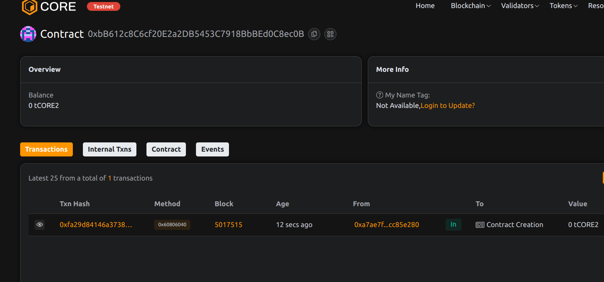

# Project Title: GuildChain: DAO Toolkit for In-Game Communities done by Ayush    jadhav

## Project Description

GuildChain is a decentralized governance system tailored for in-game communities (guilds). It allows guild members to propose, vote, and manage internal decisions using on-chain DAO mechanics.

## Project Vision

To empower gaming communities with decentralized coordination and shared decision-making, without relying on centralized platforms or infrastructure.

## Key Features

- Guild leader and member roles
- On-chain proposals with voting lifecycle
- Transparent vote tracking and result execution
- Pluggable for any game with user groups

## Future Scope

- Weighted voting based on in-game achievements
- Guild treasury for proposal-based spending
- NFT-based guild membership
- Cross-guild proposal federation system

## Contract Details
0xbB612c8C6cf20E2a2DB5453C7918BbBEd0C8ec0B

